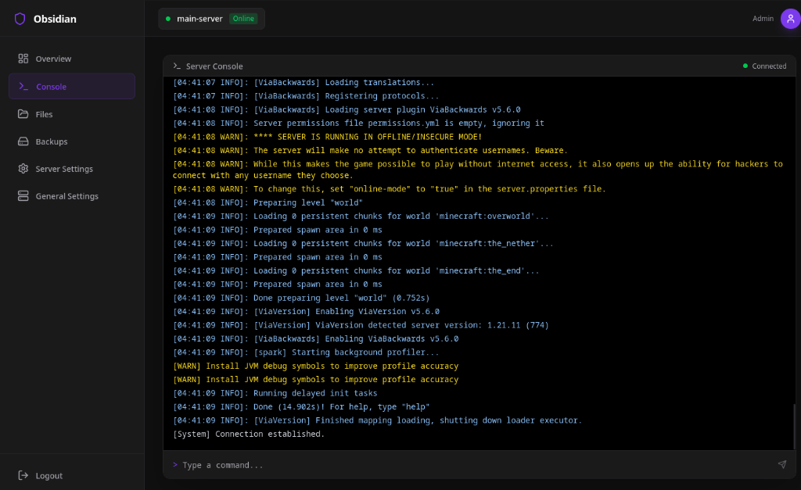
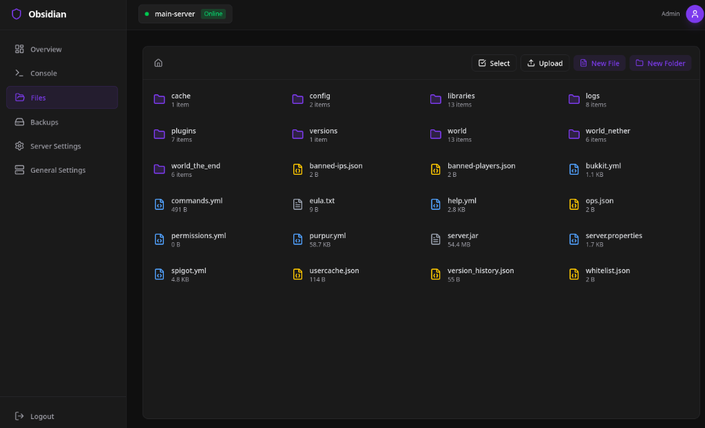
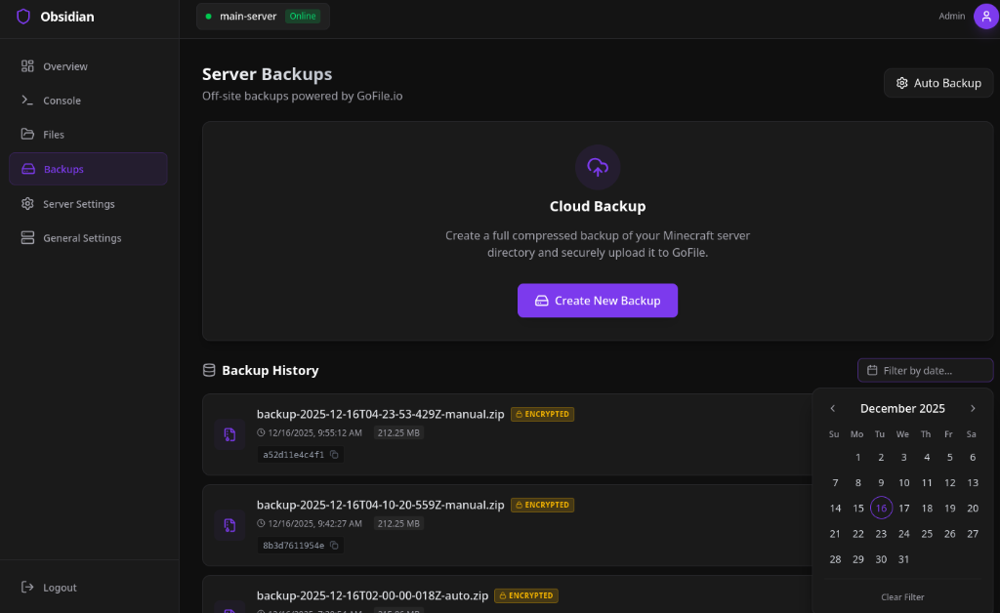
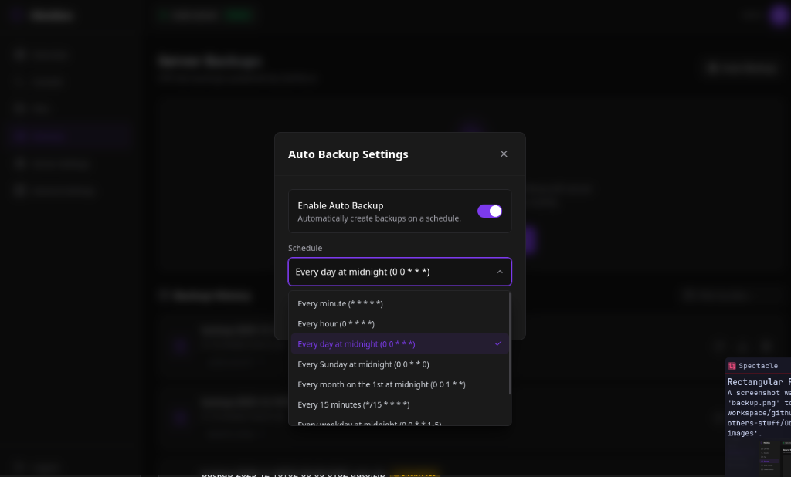
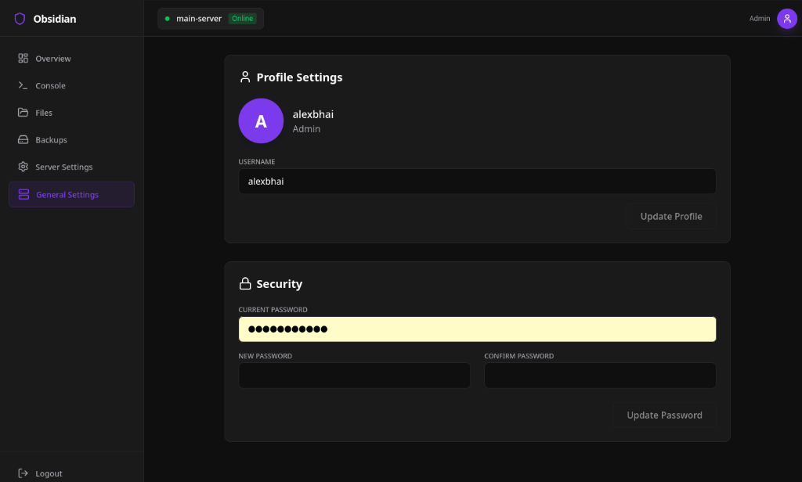

# Obsidian Panel

**Obsidian Panel** is a modern, dark-themed, and feature-rich Minecraft Server Management Panel designed to **manage a single server in the best way possible**. It provides a powerful web interface to manage your Minecraft server, handle files, schedule backups, and monitor performance.

## ✨ Features

-   **Server Control**: Start, stop, and restart your server with ease. Live console view via Socket.io.
-   **Multi-Version Support**: Native support for **Paper**, **Purpur**, and **Vanilla** Minecraft servers.
     
    

-   **File Manager**: Full-featured web-based file manager with **Drag-and-Drop** support to upload, download, edit, delete, and **extract (zip/tar)** server files.
     
    

-   **Infinite Server Backups**: Seamless integration with **GoFile** for unlimited cloud storage. Never worry about disk space again.
-   **One-Click Restore**: Restore your server from any backup with a single click (includes safety safeguards).
     
    

-   **Auto-Backup Scheduler**: Configure backups to run minutely, hourly, daily, or using custom Cron expressions.
     
    

-   **Responsive Design**: fully optimized for desktop and **mobile** use with a collapsible sidebar.
-   **Secure**: JWT-based authentication with role-based access control.
     
    

-   **Aesthetic UI**: "Obsidian" dark mode design with glassmorphism effects and smooth animations.
-   **Easy Deployment**: Fully compatible with **Coolify** and **Dockploy** for hassle-free hosting.

## 🛠️ Tech Stack

-   **Frontend**: React (Vite), Tailwind CSS, Lucide Icons.
-   **Backend**: Node.js, Express, Socket.io, Mongoose (MongoDB).
-   **System**: Uses native system calls (`child_process`) to run the Minecraft Server JAR.

## 🚀 Installation

### Prerequisites
-   **Node.js** (v18+ recommended)
-   **MongoDB** (running locally or a connection URI)
-   **Java** (installed on the host machine to run Minecraft)

### 1. Setup Backend (I willl add it soon)

## 📖 Usage

1.  Open your browser and navigate to the frontend URL.
2.  **First Login**: The first account registered automatically becomes the **Admin**.
3.  **Server Setup**:
    -   Go to **Server Settings**.
    -   Select a Minecraft version to install/download.
    -   Click **Start**.
4.  **Backups**:
    -   Go to the **Backups** tab.
    -   Click **Auto Backup** to configure your schedule.
    -   Use the manual "Create Backup" button to trigger one instantly.

## 📝 API Documentation

For detailed backend API usage, refer to the [Backend API README](backend/API_README.md).

## 📄 License

MIT License.
